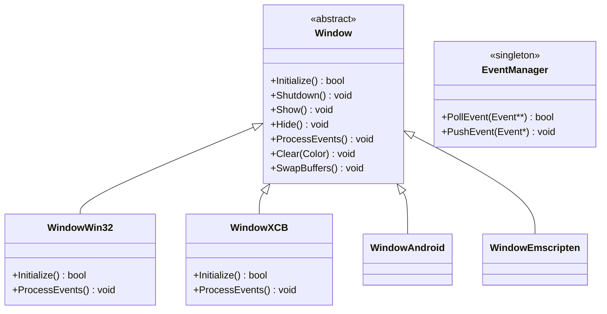
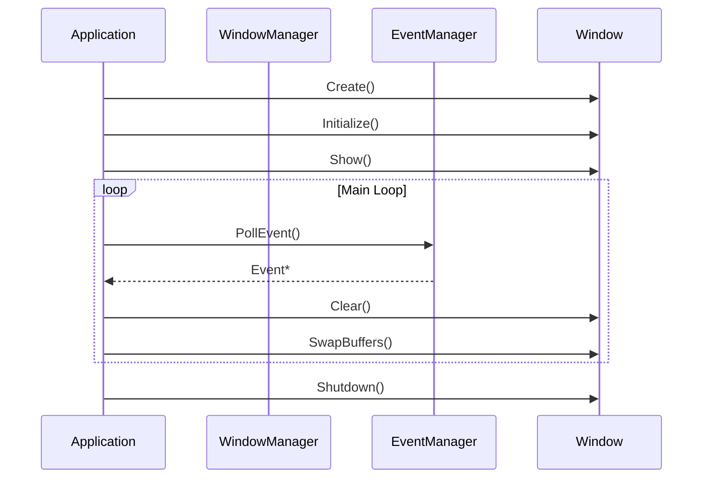

# 🎮 Unkeny2D - Framework Cross-Platform pour Applications Graphiques

**Unkeny2D** est un framework C++ moderne et multiplateforme conçu pour le développement d'applications graphiques 2D/3D, de jeux et d'interfaces utilisateur performantes. Inspiré par SFML et SDL, il offre une API simple et intuitive tout en garantissant des performances optimales sur toutes les plateformes cibles.

## 🚀 Fonctionnalités Principales

### 🌍 Multiplateforme
- **Windows** (Win32 API)
- **Linux** (XCB)
- **macOS** (Cocoa - en développement)
- **Android** (Native Activity)
- **iOS** (UIKit - en développement)
- **Emscripten** (WebAssembly)

### 🪟 Système de Fenêtrage
- Gestionnaire de fenêtres global avec IDs uniques
- Événements unifiés (clavier, souris, toucher, fenêtre)
- Support multi-fenêtres
- Boucle de jeu classique SFML-style

### 📊 Système de Rendue Extensible
- Interface abstraite pour différents backends
- Software rendering intégré (Clear/SwapBuffers)
- Architecture prête pour OpenGL, Vulkan, DirectX, Metal

### 📝 Logging Avancé
- 6 niveaux de log (TRACE, DEBUG, INFO, WARN, ERROR, FATAL)
- Sinks multiples (console, fichier, rotation, quotidien)
- Formatage personnalisable
- Thread-safe et performant

### 🧮 Bibliothèque Mathématique
- Vecteurs 2D avec opérations complètes
- Matrices 3x3 (transformation, rotation, scaling)
- Générateur de nombres aléatoires
- Constantes mathématiques précises

### ⏱️ Timing de Précision
- Sleep nanoseconde/microseconde/milliseconde
- Compatible avec toutes les plateformes

## 🏗️ Architecture du Système

```
┌─────────────────────────────────────────────────────────────┐
│                        Sandbox                               │
│              (Application d'exemple/test)                    │
└──────────────────────┬──────────────────────────────────────┘
                       │
┌──────────────────────▼──────────────────────────────────────┐
│                      Unkeny2D                                │
│          (Moteur principal - Window, Events, Rendering)     │
└──────────────────────┬──────────────────────────────────────┘
                       │
        ┌──────────────┼──────────────┐
        │              │              │
┌───────▼──────┐ ┌────▼─────┐ ┌──────▼──────┐
│    Logger    │ │ Nkentseu │ │   Maths     │
│   (Logging)  │ │  (Core)  │ │   (Math)    │
└──────────────┘ └──────────┘ └─────────────┘
```

## 📦 Installation et Build

### Prérequis
- Python 3.7+
- Compilateur C++17 (Clang, GCC, MSVC)
- Jenga Build System (inclus)

### Build Rapide
```bash
# Build Debug
jenga build --config Debug

# Build Release  
jenga build --config Release

# Exécuter l'application de test
jenga run --config Debug

# Exécuter les tests unitaires
jenga test --config Debug
```

### Build par Plateforme
```bash
# Windows
jenga build --platform Windows --config Release

# Linux
jenga build --platform Linux --config Release

# Android
jenga build --platform Android --config Release

# Emscripten
jenga build --platform Emscripten --config Release
```

## 💻 Utilisation Basique

```cpp
#include <Unkeny2D/Window/Window.h>
#include <Unkeny2D/Events/EventManager.h>
#include <Logger/Log.h>

int nkmain(int argc, char* argv[]) {
    // Initialisation du logging
    nkentseu::logger::NkentseuLogger::Initialize("MyApp", LogLevel::Info);
    
    // Création de la fenêtre
    nkentseu::Window* window = nkentseu::Window::Create("Unkeny2D App", 1280, 720);
    window->Initialize();
    window->Show();
    
    // Boucle principale
    bool running = true;
    while (running) {
        // Traitement des événements
        nkentseu::Event* event;
        while (nkentseu::EventManager::PollEvent(&event)) {
            if (event->IsType<nkentseu::WindowClosedEvent>()) {
                running = false;
            }
        }
        
        // Rendu
        window->Clear(nkentseu::Color(0.1f, 0.1f, 0.1f));
        window->SwapBuffers();
    }
    
    return 0;
}
```

## 🔧 Structure des Projets

Chaque composant est organisé en bibliothèque statique indépendante :

- **Nkentseu** : Types fondamentaux, détection de plateforme, timing
- **Logger** : Système de journalisation complet
- **Maths** : Bibliothèque mathématique 2D
- **Unkeny2D** : Moteur principal (fenêtres, événements, rendu)
- **Sandbox** : Application de démonstration

## 📊 Diagrammes UML

### Diagramme de Classes Principal


### Diagramme de Séquence - Boucle Principale


## 🎯 Cas d'Utilisation

### Développement de Jeux 2D
- Moteur de jeu léger et performant
- Gestion d'entités et de scènes
- Système de collision basique
- Support d'animation sprite

### Applications Graphiques
- Interfaces utilisateur customisées
- Visualisation de données
- Outils de création graphique
- Applications éducatives

### Prototypage Rapide
- API simple et intuitive
- Build cross-platform immédiat
- Débogage avancé avec logging
- Tests unitaires intégrés

## 🔮 Roadmap Future

### Court Terme
- [ ] Complétion des implémentations macOS/iOS
- [ ] Système de rendu OpenGL backend
- [ ] Support audio basique
- [ ] Système de ressources (images, fonts)

### Moyen Terme
- [ ] Backends Vulkan/DirectX/Metal
- [ ] Moteur de physique 2D
- [ ] Interface utilisateur avancée
- [ ] Réseau et multijoueur

### Long Terme
- [ ] Support 3D complet
- [ ] Éditeur visuel intégré
- [ ] Marketplace d'extensions
- [ ] Cloud services intégrés

## 🤝 Contribution

Le projet est ouvert aux contributions. Voir le fichier `CONTRIBUTING.md` pour les guidelines.

## 📄 Licence

MIT License - Voir le fichier `LICENCE` pour plus de détails.

---

**Unkeny2D** - Construisez l'avenir, multiplateforme dès aujourd'hui ! 🚀
#include <nkentseu/Events/EventManager.h>
#include <nkentseu/Core/Sleep.h>

using namespace nkentseu;

int nkmain(int argc, char* argv[]) {
    Window* window = Window::Create("My App", 1280, 720);
    window->Initialize();
    window->Show();
    
    bool running = true;
    
    while (running) {
        // Poll events
        Event* event = nullptr;
        while (EventManager::PollEvent(&event)) {
            if (event->IsType<WindowClosedEvent>()) {
                running = false;
            }
            if (event->IsType<KeyPressedEvent>()) {
                auto& e = event->As<KeyPressedEvent>();
                if (e.GetKeyCode() == KeyCode::Escape) {
                    running = false;
                }
            }
        }
        
        // Render
        window->Clear({0.2f, 0.3f, 0.4f, 1.0f});
        window->SwapBuffers();
        
        // Sleep optionnel
        SleepMilli(1);
    }
    
    delete window;
    return 0;
}
```

## 📝 API Principale

### Window
```cpp
Window* window = Window::Create("Title", 1280, 720);
window->Initialize();
window->Show();
window->Clear(Color(r, g, b, a));
window->SwapBuffers();
uint32 id = window->GetID();
```

### Events
```cpp
Event* event;
while (EventManager::PollEvent(&event)) {
    if (event->IsType<WindowClosedEvent>()) { ... }
    if (event->IsType<KeyPressedEvent>()) { ... }
    if (event->IsType<MouseMovedEvent>()) { ... }
    if (event->IsType<TouchBeganEvent>()) { ... }
}
```

### Sleep
```cpp
SleepNano(1000);     // 1 microseconde
SleepMicro(1000);    // 1 milliseconde
SleepMilli(16);      // ~60 FPS
Sleep(1);            // 1 seconde
```

## 🎯 Corrections Jenga pour Android/Emscripten

Le système Jenga doit être modifié pour gérer correctement les entry points :

1. **Android**: Utiliser `android_main()` au lieu de `main()`
2. **Emscripten**: Ajouter flags `-s WASM=1 -s USE_SDL=2`

Voir `JENGA_FIXES.md` pour les détails.

## 📄 Licence

Copyright © 2026 nkentseu. Tous droits réservés.
